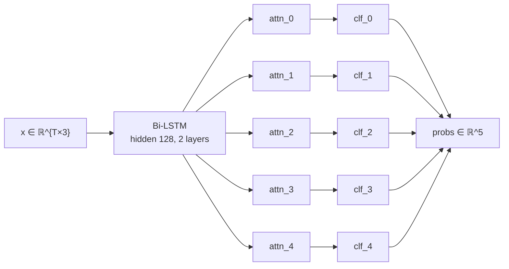
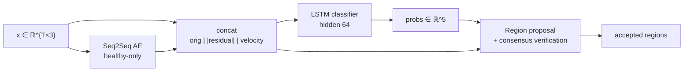

# Time-Series Defect Detection with RNNs

**Multi-label defect classification, root-cause localization, and an interactive companion dashboard for 3-sensor industrial time series.**

[](https://www.python.org/)
[](https://pytorch.org/)
[](https://fastapi.tiangolo.com/)
[](https://vuejs.org/)
[](https://plotly.com/javascript/)
[](https://www.docker.com/)
[](https://docs.astral.sh/uv/)
[](LICENSE)

Two complementary deep-learning approaches detect multiple simultaneous defects in 3-channel sensor sequences, localize the exact time intervals responsible, and identify which sensor drove each detection. A FastAPI + Vue 3 dashboard wraps both models behind eleven linked, interactive views — live sample design, file upload, batch explorer, latent space, threshold lab, streaming replay, and side-by-side comparison.

---

## 📊 Synthetic Dataset

Three sensors, variable-length sequences (40–60 timesteps), 5 multi-label defect classes. Each sample independently rolls each defect at probability 0.25, so multi-label combinations — including all-healthy — arise naturally.

| #   | Defect           | Pattern                                                    |
| --- | ---------------- | ---------------------------------------------------------- |
| 0   | Spike S0         | single-step positive impulse on Sensor 0                   |
| 1   | Dip S1           | single-step negative impulse on Sensor 1                   |
| 2   | Zero S2          | 4-step flatline at 0 on Sensor 2                           |
| 3   | Offset S1        | 8-step elevated plateau on Sensor 1                        |
| 4   | Pattern S0+S2    | 6-step coupled S0 positive + S2 negative offset            |

Base signals are independent sine waves with mild gaussian noise; defects are injected on top. Default training corpus: 50,000 samples (the original notebook generated 200,000; the CLI exposes both).

---

## 🧠 Architectures

### Approach 1 — Bi-directional LSTM with per-class attention



Encoder output: $2 \times 128 = 256$ per timestep. Each defect class has its own attention MLP $(256 \rightarrow 128 \rightarrow 1)$ followed by softmax over time and a small classifier $(256 \rightarrow 64 \rightarrow 1)$ with sigmoid. Attention weights double as explainability: for each predicted defect, the attended timesteps and the highest-variance sensor inside that window are reported as the root cause.

### Approach 2 — Seq2Seq autoencoder + supervised classifier



Stage 1 trains a single-layer LSTM autoencoder on the healthy subset only, learning the manifold of normal sensor behavior. Stage 2 stacks $[x \mid |x - \hat{x}| \mid \Delta x]$ into a 9-channel feature tensor and feeds it to a supervised LSTM classifier. Stage 3 proposes candidate defect regions from residual peaks and opposite-sign velocity-edge pairs, re-classifies each cropped region locally, and keeps only those whose local prediction agrees with the global prediction.

---

## 📈 Results

Both approaches were trained on 200,000 synthetic samples (notebook setup) and evaluated on a held-out 20% split.

**Approach 1** — macro-averaged binary metrics across 5 defect classes:

| Metric             | Value  |
| ------------------ | ------ |
| Macro precision    | 0.9997 |
| Macro recall       | 0.9985 |
| Macro F1           | 0.9991 |
| Class-4 F1 (multi) | 1.0000 |

**Approach 2** — per-defect precision / recall:

| Defect          | Precision | Recall |
| --------------- | --------- | ------ |
| Spike S0        | 1.000     | 1.000  |
| Dip S1          | 1.000     | 0.992  |
| Zero S2         | 0.667     | 0.000  |
| Offset S1       | 0.980     | 0.821  |
| Pattern S0+S2   | 1.000     | 1.000  |

Exact-match accuracy: **0.7068**. The Zero-S2 collapse is a known artifact of the autoencoder + 9-channel feature design: the AE reconstructs a flatlined signal because zero values lie inside the healthy manifold, leaving an empty residual and no anomaly signal for the classifier to latch onto. The dashboard's Comparison view makes this failure mode visible side-by-side with Approach 1.

---

## 🌟 Interactive Dashboard

`dashboard/` ships a FastAPI backend serving inference and cached analytics, and a Vue 3 single-page app that exposes both models through eleven linked sections.

- **Live Demo** — designer panel with per-defect toggles, sequence length, noise scale, seed, "surprise me". Generates a sample, runs both models, animates predictions.
- **Upload & Analyze** — drag-and-drop CSV or JSON with schema validation; pick any sequence from the result list to retarget every downstream view.
- **Batch Explorer** — filter the cached 10k test set by predicted defect, max-probability range, agreement; click any row to focus that sample. Linked co-occurrence heatmap updates with the filters.
- **Approach 1 explainability** — per-class attention heatmap, sensor-importance radar, per-class root-cause summary, click-to-pin timestep drilldown that highlights across every chart in every section.
- **Approach 2 explainability** — stacked original / residual / velocity plots with linked x-axis, animated candidate → verified → accepted region pipeline, per-region consensus badges.
- **Comparison** — same input through both models, per-defect agreement matrix, side-by-side detected regions.
- **Threshold Lab** — five sliders re-evaluate test-set metrics in under 50 ms; confusion matrix cells animate; ROC and PR curves with a live threshold marker per class.
- **Latent Space** — UMAP projection of pooled classifier hidden states colored by truth / prediction / agreement; click any point to load that sample.
- **Streaming Replay** — re-runs both models on rolling windows, scrub through the sequence to watch predictions evolve as data arrives.
- **Performance** — training loss curves and per-class metrics from `models/metrics.json`.
- **Architecture** — clickable layer diagrams of both approaches with shape and parameter inspectors.

Every interaction encodes into the URL hash, so any view is one-link-shareable.

---

## 🛠️ Tech Stack

**Backend** — Python 3.10+, PyTorch 2.9, FastAPI 0.115, Pydantic 2, NumPy, Pandas, scikit-learn, umap-learn.

**Frontend** — Vue 3, TypeScript, Vite, Pinia, Vue Router, Tailwind 4, Plotly.js, `@vueuse/motion`, Lucide icons, Inter + JetBrains Mono.

**Infrastructure** — `uv` for Python dependency management, multi-stage Dockerfiles, docker-compose for backend + frontend + optional one-shot trainer service.

---

## 📁 Project Structure

```
rnn-defect-detection/
├── src/rnn_defect_detection/
│   ├── config.py
│   ├── data/         synthetic.py · dataset.py
│   ├── models/       attention_lstm.py · seq2seq.py
│   ├── training/     attention.py · seq2seq.py
│   ├── inference/    attention.py · seq2seq.py
│   ├── viz/          matplotlib_views.py
│   └── cli.py        `python -m rnn_defect_detection {train|eval}`
├── dashboard/
│   ├── backend/      FastAPI app, schemas, routes, model registry
│   └── frontend/     Vue 3 SPA (Vite, Pinia, Plotly.js)
├── notebooks/        rnn-defect-detection.ipynb (reference)
├── tests/            core + API tests (pytest, FastAPI TestClient)
├── models/           checkpoints + analytics cache (gitignored)
├── Dockerfile        backend
├── docker-compose.yml
└── pyproject.toml
```

---

## ⚙️ Environment Variables

| Variable                  | Default                  | Purpose                                            |
| ------------------------- | ------------------------ | -------------------------------------------------- |
| `DASHBOARD_HOST`          | `0.0.0.0`                | uvicorn bind host                                  |
| `DASHBOARD_PORT`          | `8000`                   | backend port                                       |
| `MODELS_DIR`              | `./models`               | checkpoints + cache directory                      |
| `DEVICE`                  | `cpu`                    | `cpu` / `cuda` / `cuda:0`                          |
| `N_PRECOMPUTE_SAMPLES`    | `10000`                  | test-set size used for analytics caches            |
| `PRECOMPUTE_SEED`         | `2026`                   | seed for the analytics test split                  |
| `FRONTEND_URL`            | `http://localhost:5173`  | CORS allowlist entry                               |
| `VITE_API_BASE`           | `http://localhost:8000`  | API base URL for the Vite dev server               |

---

## 🚀 Setup

### Prerequisites

- Python 3.10+ with [`uv`](https://docs.astral.sh/uv/)
- Node 22+ with `pnpm` or `npm` (only for frontend development)
- Docker + Docker Compose (optional, recommended for the full stack)

### Quick start — Docker Compose

```bash
cp .env.example .env

# Train both models once (writes to the shared `models` volume):
docker compose --profile training up trainer

# Then launch the backend + frontend:
docker compose up backend frontend
```

Open <http://localhost:5173>.

### Quick start — local development

```bash
uv sync

# Train both approaches (--quick = 10k samples × 3 epochs for a fast first run)
uv run python -m rnn_defect_detection train --approach attention --quick
uv run python -m rnn_defect_detection train --approach seq2seq --quick

# Backend
uv run uvicorn dashboard.backend.app:app --reload

# Frontend (separate terminal)
cd dashboard/frontend
pnpm install
pnpm dev
```

### Upload your own time series

CSV (long form):

```csv
sequence_id,t,sensor_0,sensor_1,sensor_2
my_run,0,0.12,-0.34,0.56
my_run,1,0.18,-0.30,0.55
```

Optional ground-truth columns: `defect_0, defect_1, defect_2, defect_3, defect_4` (one row per sequence).

JSON:

```json
[
  { "x": [[0.12, -0.34, 0.56], [0.18, -0.30, 0.55]], "y_true": [1, 0, 0, 0, 0] }
]
```

Hard limits: 5 MB, 200 sequences per upload, 500 timesteps each.

---

## 🚢 Deployment

The backend Dockerfile is a multi-stage build that resolves dependencies with `uv` in stage one and ships only the runtime venv in stage two, with a non-root user and a `/health` healthcheck. The frontend Dockerfile compiles the Vite bundle and serves it from nginx-alpine with an `/api/` proxy to the backend service. A named Docker volume keeps trained checkpoints between containers.

For a production cluster: bake the trained checkpoints into the backend image or mount them from object storage, set `N_PRECOMPUTE_SAMPLES` to fit your memory budget, point `DEVICE=cuda` if GPU inference is available.

---

## 🏛️ Key Architecture Decisions

- **Per-class attention** rather than a single shared attention head — each defect localizes independently; cost is $5\times$ a small MLP, negligible against the LSTM backbone.
- **Optional packed sequences** — Approach 1 historically padded with zeros and ignored lengths, which let padding leak into the bidirectional reverse pass; the rewrite accepts an optional `lengths` argument and routes through `pack_padded_sequence` when provided, leaving the notebook's call site unchanged.
- **`PADDING_VALUE = -100`** in Approach 2 — a distinct sentinel keeps the masking unambiguous when residual / velocity derivatives would otherwise propagate padding artifacts.
- **Cached test-set analytics** — running both models over the test set at startup and serving threshold metrics, batch rows, and UMAP from cache keeps interactive sliders feeling instantaneous. Cache is persisted under `models/cache/` so subsequent restarts are sub-second.
- **Consensus rule for Approach 2 regions** — a local prediction is only accepted if it agrees with the global prediction for the same class. This filters out region proposals that look anomalous in isolation but disagree with the model's overall take.

---

## 📚 References

- *Long Short-Term Memory* — Hochreiter, S. & Schmidhuber, J. (1997). [doi:10.1162/neco.1997.9.8.1735](https://doi.org/10.1162/neco.1997.9.8.1735)
- *Bidirectional Recurrent Neural Networks* — Schuster, M. & Paliwal, K. K. (1997). [doi:10.1109/78.650093](https://doi.org/10.1109/78.650093)
- *Neural Machine Translation by Jointly Learning to Align and Translate* — Bahdanau, D., Cho, K. & Bengio, Y. (2014). [arXiv:1409.0473](https://arxiv.org/abs/1409.0473)
- *LSTM-based Encoder-Decoder for Multi-sensor Anomaly Detection* — Malhotra, P., Ramakrishnan, A., Anand, G., Vig, L., Agarwal, P. & Shroff, G. (2016). [arXiv:1607.00148](https://arxiv.org/abs/1607.00148)

---

## 📝 License

MIT — see [LICENSE](LICENSE).
